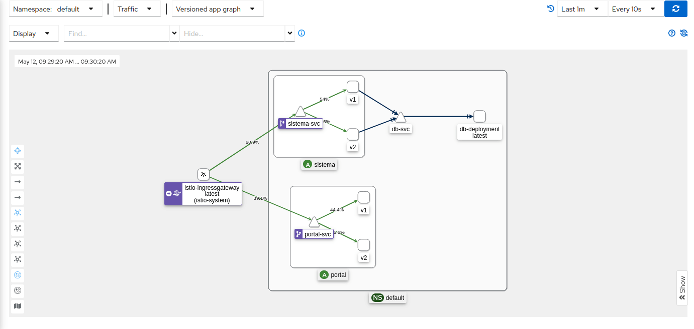
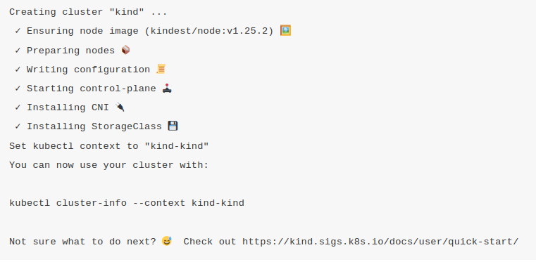
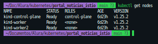

<p>
  
  
</p>

<h1 align="center">Alura cursos Projeto Portal de Noticias </h1>

### Kubernetes, ISTIO Service Mesh

## 1 - Instalação.

### Kubectl

Kubernetes command-line tools(<a href="https://kubernetes.io/docs/tasks/tools/">kubectl</a>) permite executar comandos em seus clusters kubernetes

### Kind

<a href='https://kind.sigs.k8s.io/' target="_blank">Kind</a> é uma ferramenta que permite executar Clusters Kubernetes usando "nodes" docker containers.

## 2 - Iniciando o cluster

`kind create cluster`

<p>
  
</p>

- Visualizando os nós com kind

`kind create cluster`

- Listar nós

`kubectl get nodes`

## 3 - Criando cluster com multiplos nós

- Executar o comando a seguir para selecionar e remover todos os clusters locais criados no Kind.

`kind delete clusters $(kind get clusters)`

- Executar arquivo de especificação kind-3nodes.yaml

`kind create cluster --name kind-multinodes --config kind-3nodes.yaml`

- Validar a criação do cluster com o comando a seguir

`kubectl get nodes`

<p>
  
</p>

## 4 - Instalação ISTIO

- <a href='https://istio.io/latest/docs/setup/getting-started/#download' target="_blank">Download</a>
- <a href='https://istio.io/latest/docs/setup/getting-started/#install' target="_blank">Instalação</a>

Adicionar seguinte label ao namespace para que o ISTIO injete os Sidecars proxy automaticamente quando realizarmos os deploys da aplicação

`kubectl label namespace default istio-injection=enabled`

## 5 - Determinando ingress IP e porta

Para ambientes sem load balancer externo

```
export INGRESS_PORT=$(kubectl -n istio-system get service istio-ingressgateway -o jsonpath='{.spec.ports[?(@.name=="http2")].nodePort}')
export SECURE_INGRESS_PORT=$(kubectl -n istio-system get service istio-ingressgateway -o jsonpath='{.spec.ports[?(@.name=="https")].nodePort}')
export INGRESS_HOST=$(kubectl get po -l istio=ingressgateway -n istio-system -o jsonpath='{.items[0].status.hostIP}')
export GATEWAY_URL=$INGRESS_HOST:$INGRESS_PORT

```

Verficar se IP e porta foram criadas

`echo "$GATEWAY_URL"`
192.168.99.100:32194

## 5 - Aplicando as configurações

- portal-configmap.yml - Alterar IP_SISTEMA para o IP externo do sistema noticias

Criar os seguintes items nessa ordem:

```markdown
├── app-gateway.yaml
├── destination-rule-all.yaml
├── portal-noticias
│ ├── aluracursos.png
│ ├── db-deployment.yml
│ ├── db-noticias-configmap.yml
│ ├── db-noticias-svc.yml
│ ├── db-noticias.yml
│ ├── deployment.png
│ ├── kubernetes_dashboard.png
│ ├── portal-configmap.yml
│ ├── portal-deployment-v1.yml
│ ├── portal-deployment-v2.yml
│ ├── portal-hpa.yml
│ ├── portal-replicaset.yml
│ ├── portal-service.yml
│ ├── portal.yml
│ ├── README.md
│ ├── service_list.png
│ ├── sistema-noticias-configmap.yml
│ ├── sistema-noticias-deployment-v1.yml
│ ├── sistema-noticias-deployment-v2.yml
│ ├── sistema-noticias-service.yml
│ └── sistema-noticias.yml
├── portal-virtual-service.yaml
├── README.md
├── sistema-virtual-service.yaml
└── virtual-service-all.yaml
```

`kubectl apply -f item`

## 4 - Acessando o Portal de Noticias

Para acessar o Portal e o Sistema de Noticias fora do cluster é necessario fazer as seguintes configurações:

`minikube service portal-svc --url`

`minikube sistema-noticias-svc --url`

`minikube service list`

<p>
  
  
</p>

Acessar as URLs geradas no navegador

## 4 - Acessando o Kubernetes Dashboard

<p>
  
  
</p>

Kubernetes Dashboard é ferramenta web onde é possível criar e modificar recursos como Deployments, Jobs, Services, verificar de forma visual consumo de CPU e memoria e monitorar o estado dos pods

<a href="https://kubernetes.io/docs/tasks/access-application-cluster/web-ui-dashboard/" target="_blank">Documentação</a>

## Autor

👤 **Marcus Vinicius**

- Github: [marcusjava](https://github.com/marcusjava)
