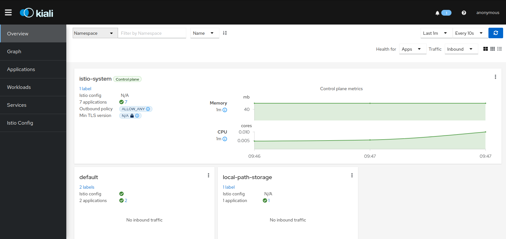

<p>
  
  
</p>

<h1 align="center">Alura cursos Projeto Portal de Noticias </h1>

### Kubernetes, ISTIO Service Mesh

## 1 - Instalação.

### Kubectl

Kubernetes command-line tools(<a href="https://kubernetes.io/docs/tasks/tools/">kubectl</a>) permite executar comandos em seus clusters kubernetes

### Kind

<a href='https://kind.sigs.k8s.io/' target="_blank">Kind</a> é uma ferramenta que permite executar Clusters Kubernetes usando "nodes" docker containers.

## 2 - Iniciando o cluster

`kind create cluster`

<p>
  
</p>

- Visualizando os nós com kind

`kind create cluster`

- Listar nós

`kubectl get nodes`

## 3 - Criando cluster com multiplos nós

- Executar o comando a seguir para selecionar e remover todos os clusters locais criados no Kind.

`kind delete clusters $(kind get clusters)`

- Executar arquivo de especificação kind-3nodes.yaml

`kind create cluster --name kind-multinodes --config kind-3nodes.yaml`

- Validar a criação do cluster com o comando a seguir

`kubectl get nodes`

<p>
  
</p>

## 4 - Instalação ISTIO

- <a href='https://istio.io/latest/docs/setup/getting-started/#download' target="_blank">Download</a>
- <a href='https://istio.io/latest/docs/setup/getting-started/#install' target="_blank">Instalação</a>

Adicionar seguinte label ao namespace para que o ISTIO injete os Sidecars proxy automaticamente quando realizarmos os deploys da aplicação

`kubectl label namespace default istio-injection=enabled`

## 5 - Determinando ingress IP e porta

Para ambientes sem load balancer externo

```
export INGRESS_PORT=$(kubectl -n istio-system get service istio-ingressgateway -o jsonpath='{.spec.ports[?(@.name=="http2")].nodePort}')
export SECURE_INGRESS_PORT=$(kubectl -n istio-system get service istio-ingressgateway -o jsonpath='{.spec.ports[?(@.name=="https")].nodePort}')
export INGRESS_HOST=$(kubectl get po -l istio=ingressgateway -n istio-system -o jsonpath='{.items[0].status.hostIP}')
export GATEWAY_URL=$INGRESS_HOST:$INGRESS_PORT

```

Verficar se IP e porta foram criadas

```
echo "$GATEWAY_URL
192.168.99.100:32194
```

## 6 - Aplicando as configurações

```markdown
├── app-gateway.yaml
├── destination-rule-all.yaml
├── kind-3nodes.yaml
├── portal-noticias
│ ├── db-deployment.yml
│ ├── db-noticias-configmap.yml
│ ├── db-noticias-svc.yml
│ ├── db-noticias.yml
│ ├── portal-configmap.yml
│ ├── portal-deployment-v1.yml
│ ├── portal-deployment-v2.yml
│ ├── portal-service.yml
│ ├── sistema-noticias-configmap.yml
│ ├── sistema-noticias-deployment-v1.yml
│ ├── sistema-noticias-deployment-v2.yml
│ ├── sistema-noticias-service.yml
│ └── sistema-noticias.yml
```

Criar os seguintes items nessa ordem:

- Gateway

`kubectl apply -f app-gateway.yaml`

- Workloads

`kubectl apply -f portal-noticias`

- Destination Rules

`kubectl apply -f destination-rule-all.yaml`

## 4 - Acessando o Portal de Noticias através do navegador

Portal Noticias:

http://$GATEWAY_URL/

Sistema Noticias:

http://$GATEWAY_URL/sistema

## 4 - Acessando o ISTIO Dashboard

ISTIO possui integração com <a href="https://istio.io/latest/docs/ops/integrations/kiali/" target="_blank">Kiali</a> dashboard e outras ferramentas de teletria. Para adicionar basta navegar para a pasta do istio e executar o seguinte comando.

```
kubectl apply -f samples/addons
kubectl rollout status deployment/kiali -n istio-system
istioctl dashboard kiali

```

<p>
  
</p>

## Autor

👤 **Marcus Vinicius**

- Github: [marcusjava](https://github.com/marcusjava)
